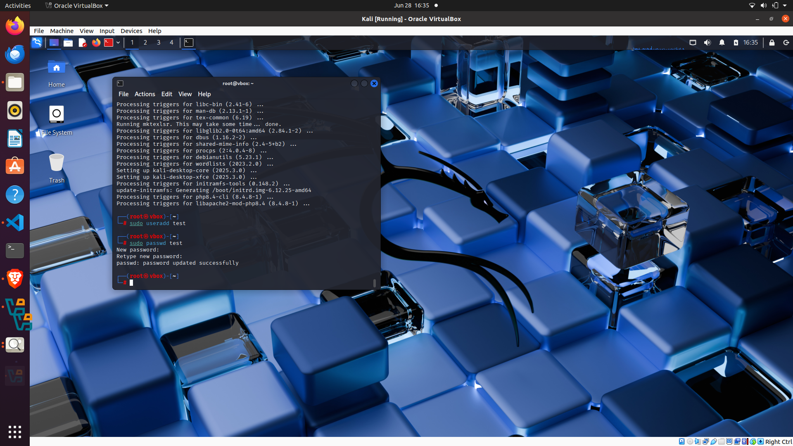
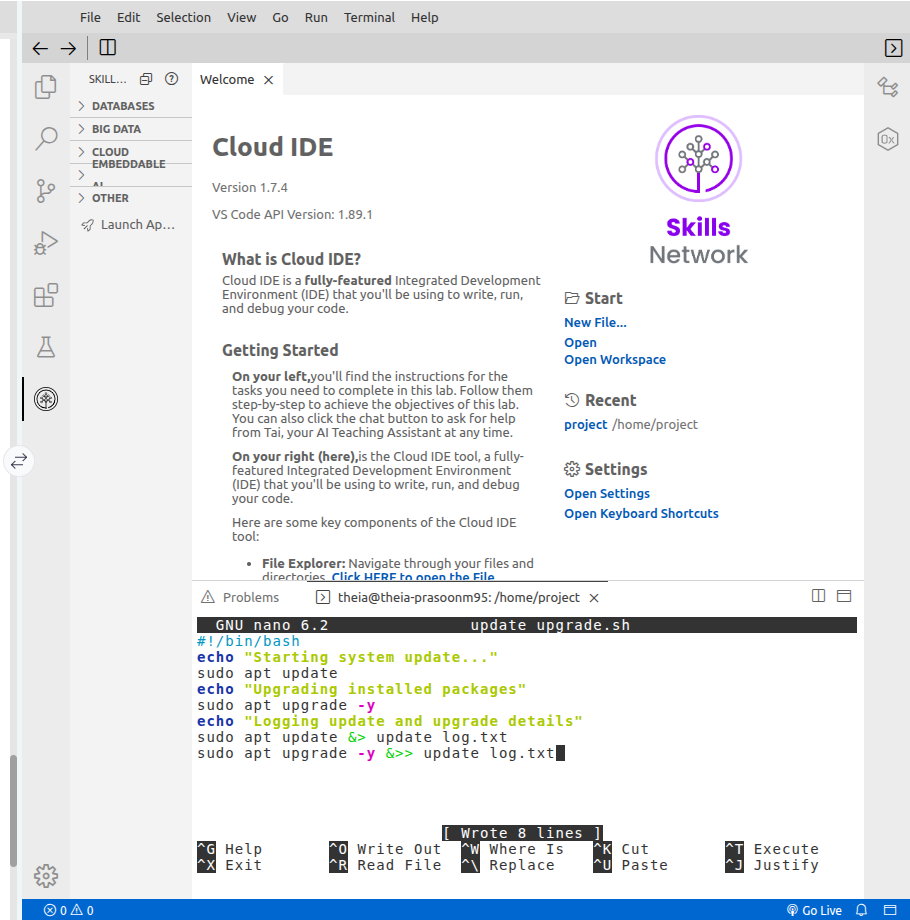
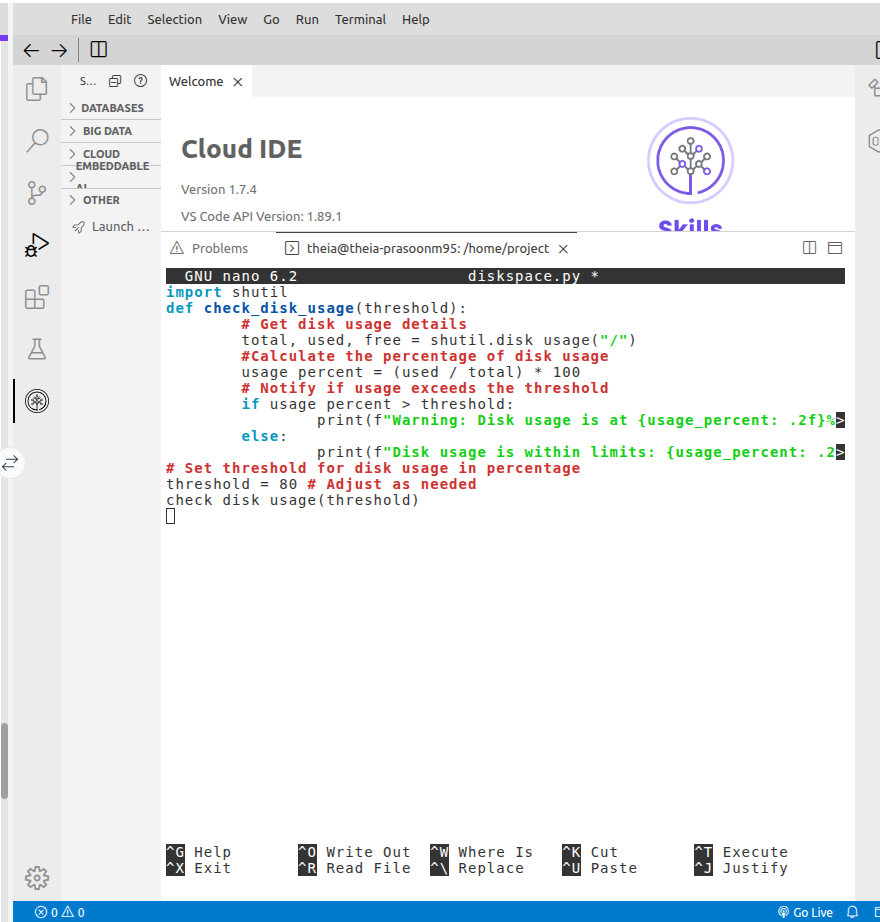
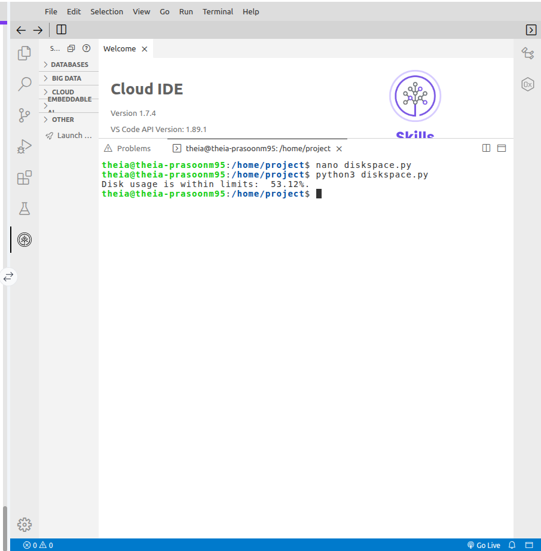

Ethical Hacking Lab 1: Kali Linux Setup & Tools

**Based on IBM's "Ethical Hacking with Kali Linux"**

Purposes:
- Setting up Kali Linux in a virtual machine and exploring its capabilites:
  - Penetration testing: Simulating real world attacks to access systems so you can learn to analyze your software weaknesses.
  - Vulnerability analysis: Scanning for weaknesses in systems and networks.
  - Digital Forensics: Looking for information and data that may not be safe from cyber criminals.
  - Network Security: Monitoring networks to detect cyber attacks or other suspicious activity.

Environment Setup:

- Used Virtual box (https://www.virtualbox.org) and downloaded the version that matched my Ubuntu Linux version.
- Installed VirtualBox on Ubuntu terminal using dpkg:
   - Command line: sudo dpkg -i <InstallFile>
- Download kali linux (kali.org) and imported it into the virtual machine.

Hardening Kali Linux:

- User Access Management: Simulated the concept of group access to directories so employees in the same role have the same level of access.
- Firewall Manipulation: Preventing unathorized access to networks
- Example of Command Lines executed in the terminal (opening ports such as 23 to mimic securing the infrastrucutre):
    sudo apt install ufw
    sudo ufw enable
    sudo ufw allow 22
    sudo ufw allow 23
    sudo ufw allow 80
    sudo ufw status verbose

Information Gathering/Digital Forensics:

- Executed the whois keyword in the terminal, provides domain registration info on common websites, can be used forpenetration testing.
- Nmap, used for network scanning and security:
   - Simulated basic and agressive scans to analyze vulnerabilities.

Security coding:

- Wrote basic scripts using Python 3 to analyze disk usage on my computer.
- Wrote scripts using Bash to automate system maintence tasks such as an update script:
    chmod +x update_upgrade.sh
   ./update_upgrade.sh
    cat update_log.txt

More information on Kali Linux tools:
- Can run vulnerability analysis on databases therefore affecting the AI/ML models that businesses want to achieve.
- Tools and their associated description:
 SQLmap	detects and exploits SQL injection flaws.
 SQLninja	performs database fingerprinting and data extraction.
 jSQL Injection	automates detection and exploitation of SQL injection vulnerabilities.

Summary 
I learned how to:
- Use a virtual lab environment in Ubuntu Linux to get Kali Linux to run successfully.
- Apply Kali Linux tools to begin basic digital forensics and security cdoing/tasks including vulnerability analysis assessments.
- Harden the system as an administrator learning network security.
- Value the purpose of confidential information that can potentially be used for penetration testing.

